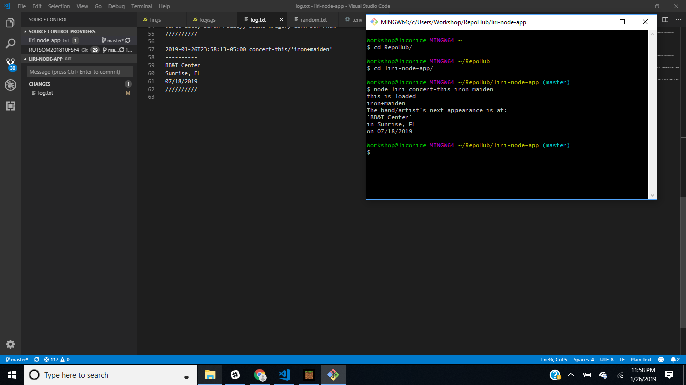
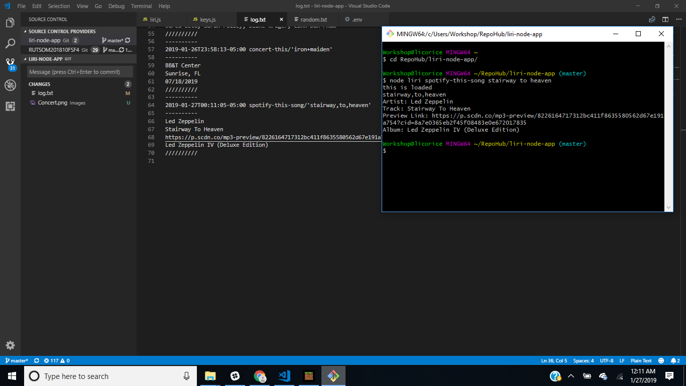
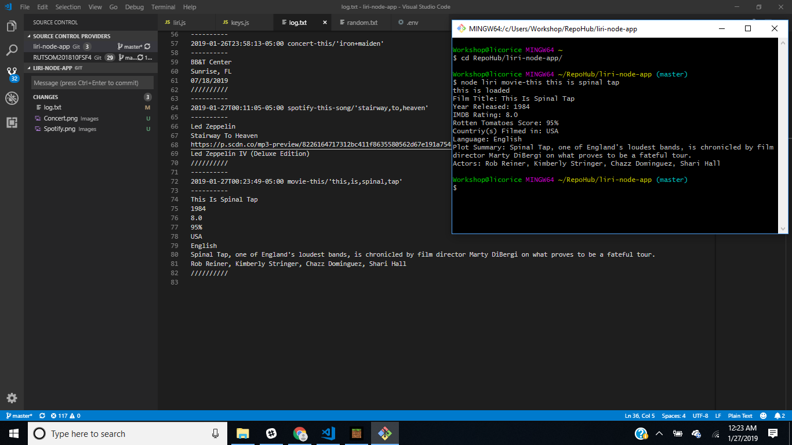
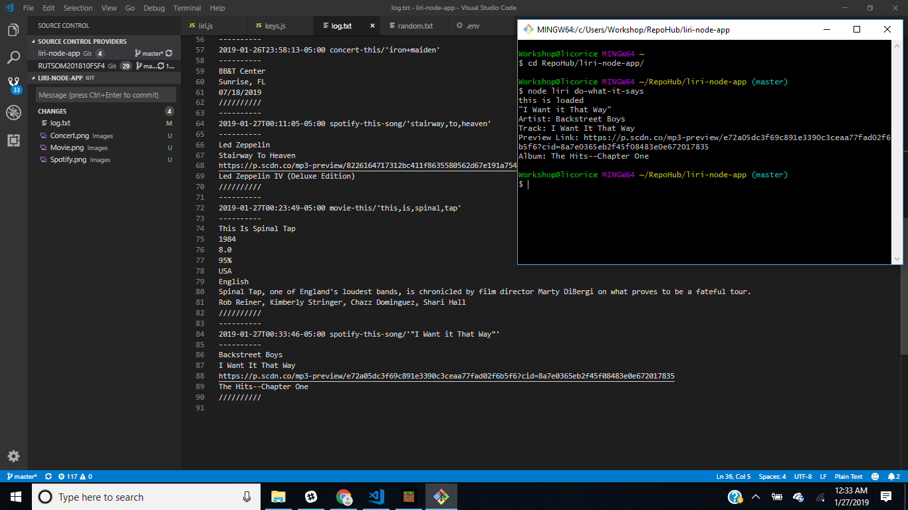

# liri-node-app
Week 10, Node

## **LIRI-Bot** **L**anguage  **I**nterpretation and **R**ecognition **I**nterface
----

This project uses the Node Package Manager "NPM" modules for Spotify_API, Axios, and "moment".
Langauge intepratation comes through a command-line interface in a Node.js environment, and works with pre-defined commands to produce results from API calls. As it is a user interface, some error handling is present, as well as an in-app help. Using the commands is based off of Node, so they all start with ["node liri.js"], followed by the commands, and search request.
###### __Please note, this project *requires* a .env file with Spotify credentials to work__

There are four commands to utilize;

... 
__{concert-this} {search term};__ This uses Axios to GET from The __BANDSINTOWN__-Api, and retrieves...
  ..* Artist Name
  ..* Venue
  ..* Venue Location
  ..* and performance date in MM/DD/YYYY format

... 
__{spotify-this-song} {search term};__ This uses the __Node-Spotify-API__ package to search for song information such as...
  ..* Artist Name
  ..* Track Title
  ..* Preview Link (when applicable)
  ..* Album
  
  ... 
__{movie-this} {search term};__ This uses Axios with the Open Movie DataBase "OMDB" API to pull quite a bit of info from a selected movie... 
  ..* Movie Title
  ..* Year of Release
  ..* IMDB Rating
  ..* Rotten Tomatoes Score
  ..* Country
  ..* Language
  ..* Plot
  ..* Actors
  
  ... 
__{do-what-it-says}__ this will use the native Node filesystem module to read a supplied file "Random.txt." The file information contains a command and search topic that will direct another LIRI search. In this case, it is not very random, the file contains the string '_spotify-this-song,"I Want it That Way"_' and the result should be from that command.
  
 __log.txt__
 ...All complete requests get a light text dump to this file. The format has a header with a time/date stamp, command, and request string, followed by the data collected, in the order it had been collected.
 
  __Error Handling__
 ...Required placeholders have been added to the program to fill all qualifications. Those are, _"Mr. Nobody"_, as a blank search default for __{movie-this}__, and, _"The Sign"_, for __{spotify-this-song}__. A rudmentary error message was made for incomplete commands, which was also applied to __{concert-this}__. Miss-typed or non-commands are given an error message as well. 
  
  __Help!__
 ...HELP! _o/~ I need somebody o/~..._ Yes! There is a help. It is technically another command, __{help}__ and it simply displays the possible commands, and app use syntax. i.e. ["node liri.js {command} {request}"]

All features are displayed in this [DEMO!](https://drive.google.com/file/d/1adCb48Lf58JMJvv1Cp7dMgXeEN_F4Zm2/view "DEMO!")
